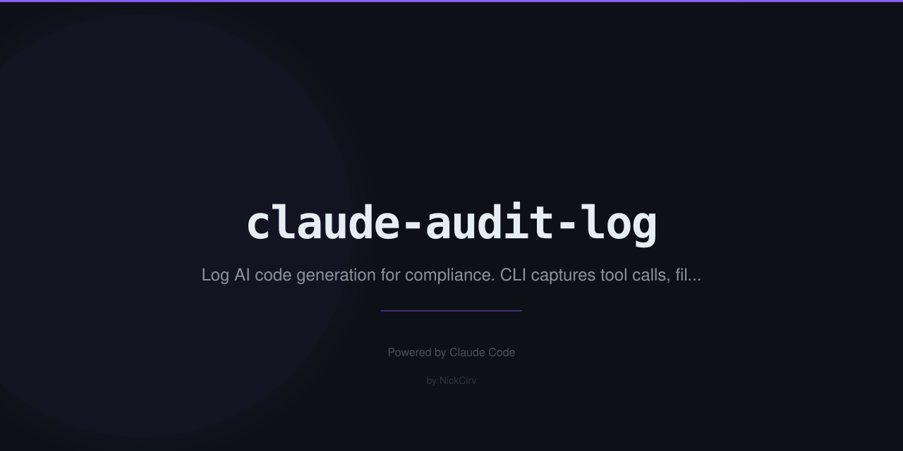

# claude-audit-log

Compliance audit trail for AI-generated code changes. SOC2 / ISO 27001 ready.

Logs every Claude Code tool invocation — files changed, lines added/removed, git hashes, model used — into a tamper-evident append-only JSONL file at `~/.claude-audit/audit.jsonl`.

## Install

```bash
npx claude-audit-log install
```

Adds a `PostToolUse` hook to `~/.claude/settings.json`. Logging starts immediately on the next Claude Code session.

## Commands

```bash
# Browse entries (newest first, paginated)
npx claude-audit-log view
npx claude-audit-log view --limit 50 --page 2
npx claude-audit-log view --project /my/repo --model claude-sonnet-4-6

# Export for compliance
npx claude-audit-log export --format csv --output audit-2026-02.csv
npx claude-audit-log export --format json --since 2026-02-01 --until 2026-02-28

# Summary statistics
npx claude-audit-log stats
npx claude-audit-log stats --since 2026-01-01

# Search entries
npx claude-audit-log search src/auth
npx claude-audit-log search claude-opus --limit 10
```

## What Gets Logged

Every AI tool call produces one JSON line:

```json
{
  "timestamp": "2026-02-27T14:23:11.042Z",
  "sessionId": "a1b2c3d4e5f6a7b8",
  "model": "claude-sonnet-4-6",
  "tool": "Edit",
  "project": "/Users/nick/repos/my-app",
  "files": ["/Users/nick/repos/my-app/src/auth.ts"],
  "linesAdded": 12,
  "linesRemoved": 3,
  "gitHashBefore": "abc1234",
  "gitHashAfter": "abc1234",
  "prevHash": "0000...0000",
  "hash": "sha256-of-entry-plus-prevHash"
}
```

## Tamper Detection

Each entry includes a SHA-256 hash of its own content chained to the previous entry's hash. Any modification to past entries breaks the chain. Verify with:

```bash
node -e "import('./src/logger.js').then(m => m.verifyChain().then(r => console.log(r)))"
```

## Storage

- **Audit log:** `~/.claude-audit/audit.jsonl` — append-only, one JSON object per line
- **Chain head:** `~/.claude-audit/chain-head.txt` — current tip hash for chain verification

## Compliance Use Cases

- **SOC2 Type II:** Evidence that AI tool usage is logged and attributable
- **ISO 27001:** Audit trail for access to source code via AI assistants
- **GDPR/HIPAA:** Demonstrate oversight of AI-generated changes touching sensitive data
- **Code review audit:** Export CSV, attach to PR reviews or change requests

## Requirements

- Node.js >= 18
- Python 3 (for the hook script — ships with macOS/Linux)
- Claude Code with PostToolUse hook support
